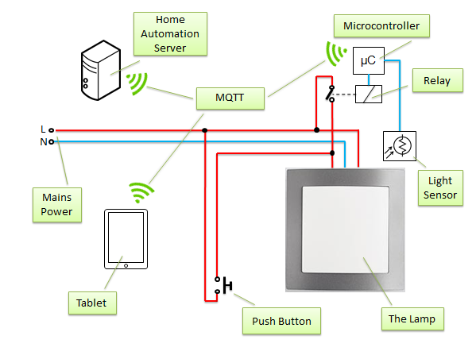

#esp-lamp-in-sw

This is an ESP8266 application to control electronic dimmable ballasts for fluorescent tubes.

|  |  |  |
| --- | --- | --- |
| [Hacking the Square on YouTube](https://www.youtube.com/watch?v=OhAHjVcAv_0) | [Wiki on GitHub](https://github.com/krzychb/esp_lamp_in_sw/wiki/) | [ESP8266 Forum](http://www.esp8266.com/viewtopic.php?f=11&t=4782) |

For additional information please refer to YouTube video [Hacking the Square](https://www.youtube.com/watch?v=OhAHjVcAv_0), [Wiki](https://github.com/krzychb/esp_lamp_in_sw/wiki/) and [ESP9266 forum](http://www.esp8266.com/viewtopic.php?f=11&t=4782).

##Tested with

* [Philips HF-REGULATOR Touch and Dim HF-R T 236 220-240](http://www.lighting.philips.com/pwc_li/in_en/assets/docs/products/DALI%20Dimmable%20Ballast.pdf)
* [OSRAM QUICKTRONIC - INTELLIGENT QTi DALI 2x28/54 DIM](https://www.osram.com/media/resource/hires/335428/data-sheet-for-product-families-osram-qti-dali...dim.pdf)

##Features

* Switch the lamp on / off
* Dim to specific light intensity
* Read back on/off status and intensity
* Read back result of last operation
* Calibrate

##ESP9266 Application

Application for ESP8266 has been developed, compiled and loaded using [Unofficial Development Kit for Espressif ESP8266 by Mikhail Grigorev](http://programs74.ru/udkew-en.html) (thanks) and  communicates with external world using [MQTT client library for ESP8266 Soc](https://github.com/tuanpmt/esp_mqtt) (thanks). 

##Required

* ESP8266 with GPIO and exposed ADC
* Relay connected to the GPIO
* Light sensor connected to the ADC
* Touch and dim lamp connected to the relay
* MQTT Broker
* MQTT Client

##Usage

* Lamp control routines are implemented as a separate library [lightsw](lightsw/)
* Method of interfacing with [lightsw](lightsw/) is of your choice (no need for MQTT)

##Contributing

Feel free to contribute to the project in any way you like!

##Author

krzychb

##Donations

Invite me to freshly squeezed orange juice.

##LICENSE - "MIT License"

Copyright (c) 2015 krzychb

Permission is hereby granted, free of charge, to any person obtaining a copy of this software and associated documentation files (the "Software"), to deal in the Software without restriction, including without limitation the rights to use, copy, modify, merge, publish, distribute, sublicense, and/or sell copies of the Software, and to permit persons to whom the Software is furnished to do so, subject to the following conditions:

The above copyright notice and this permission notice shall be included in all copies or substantial portions of the Software.

THE SOFTWARE IS PROVIDED "AS IS", WITHOUT WARRANTY OF ANY KIND, EXPRESS OR IMPLIED, INCLUDING BUT NOT LIMITED TO THE WARRANTIES OF MERCHANTABILITY, FITNESS FOR A PARTICULAR PURPOSE AND NONINFRINGEMENT. IN NO EVENT SHALL THE AUTHORS OR COPYRIGHT HOLDERS BE LIABLE FOR ANY CLAIM, DAMAGES OR OTHER LIABILITY, WHETHER IN AN ACTION OF CONTRACT, TORT OR OTHERWISE, ARISING FROM, OUT OF OR IN CONNECTION WITH THE SOFTWARE OR THE USE OR OTHER DEALINGS IN THE SOFTWARE.

